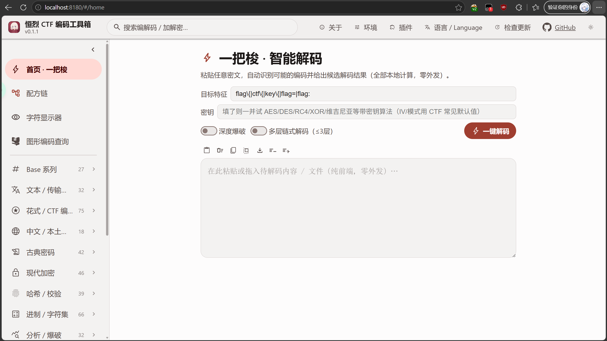
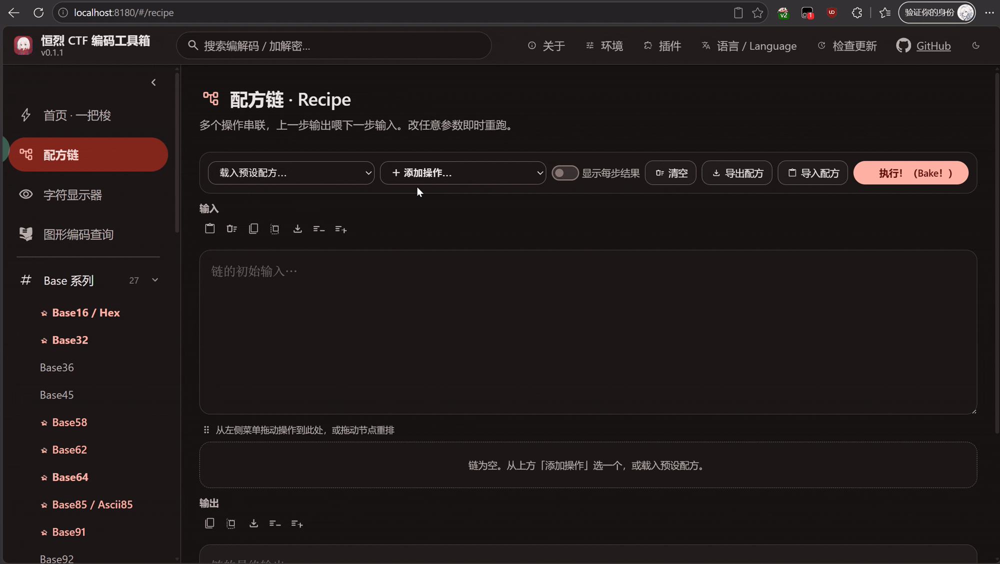
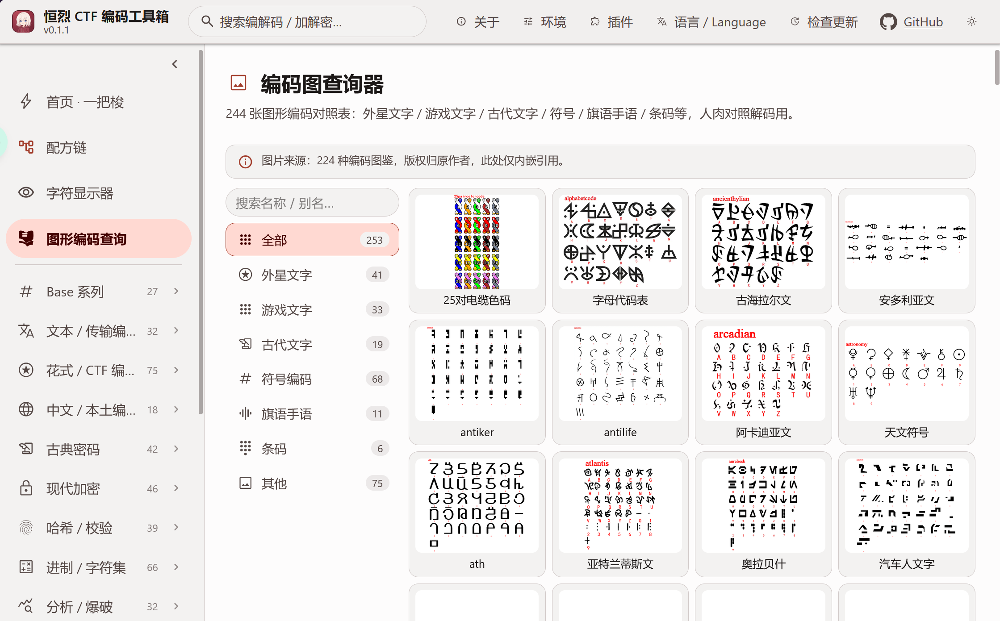
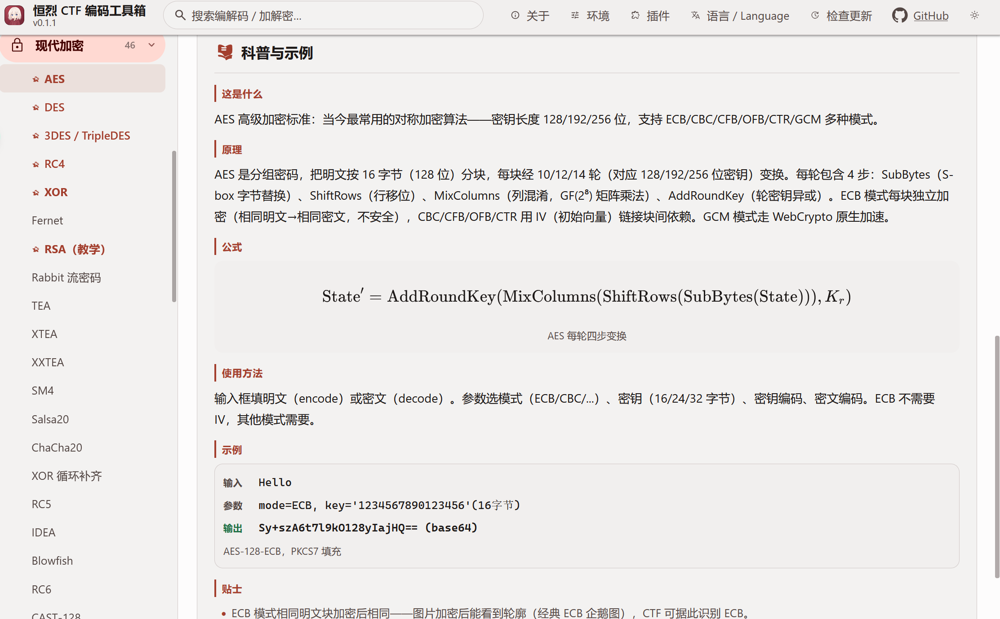
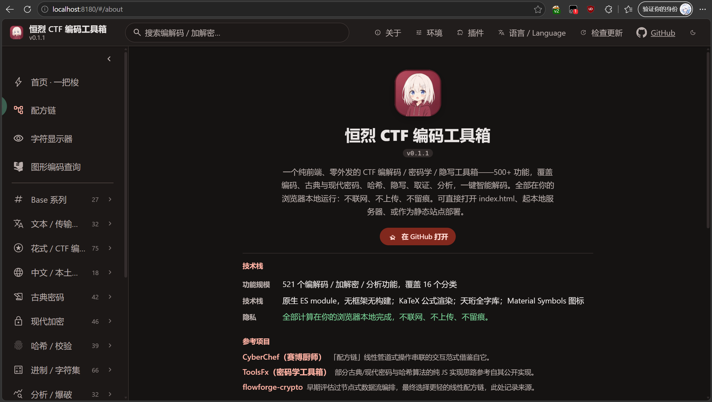

<p align="center">
  
</p>
<h1 align="center">
  <span>恒烈 CTF 编码工具箱 · EBCTFCodeBox</span>
</h1>
<p align="center">
  <span align="center">纯前端、零外发的 CTF 编解码 / 加解密 / 隐写分析工具箱，500+ 编解码算法全在浏览器本地运行，不向任何服务器发送一个字节。</span>
</p>

  

  

> [!WARNING]
> 本工具仅供 CTF 学习、竞赛与安全研究使用。请勿将其用于任何违法违规、侵犯他人权益或可能给你自己带来麻烦的用途。使用者需自行承担因不当使用产生的一切后果。
> 如果你在使用中发现 Bug、算法结果异常或文档缺失，欢迎提交 Issue，最好附上输入样例、期望输出和复现步骤。

## 目录

- [项目简介](#项目简介)
- [特点](#特点)
- [界面预览](#界面预览)
- [运行](#运行)
- [平台兼容性](#平台兼容性)
- [性能要求](#性能要求)
- [目录结构](#目录结构)
- [编解码全清单](#编解码全清单500-ops--10-分类)
- [插件与 AI 接入](#插件与-ai-接入)
- [开源协议](#开源协议)
- [第三方资源与许可](#第三方资源与许可)
- [隐私](#隐私)

## 项目简介

`恒烈 CTF 编码工具箱`（EBCTFCodeBox）是一个面向 CTF 选手的纯前端编解码工具箱。

它把 CTF 里常见的编码、古典密码、现代加密、哈希校验、进制转换、密码分析爆破、隐写图像等能力汇聚到一个页面里，所有计算在浏览器本地完成，不联网、不上传。目标是：打开一个网页，就能应付赛场上绝大多数编解码需求。

核心设计：

- 原生 ES module，无框架、无构建步骤
- C / emscripten 编译的 WASM 承担高性能算法
- Material 3 温和红主题，暗 / 亮色切换
- 内置天珩全字库，冷僻字符照样显示
- 中英双语

---

## 特点

- **纯前端 · 零外发**：原生 ES module，无框架、无构建步骤。所有编解码在浏览器本地跑，不联网、不上传。「外链」仅生成 URL 供你自己点开，绝不由前端把数据 fetch 出去。
- **一把梭智能解码**：粘贴或拖入内容，自动识别可能的编码链并给出候选解码结果，支持 crib 目标特征过滤与深度爆破。
- **500+ 编解码算法**，覆盖十大分类：Base 系列 / 文本传输编码 / 花式 CTF 编码 / 中文本土编码 / 古典密码 / 现代加密 / 哈希校验 / 进制字符集 / 分析爆破 / 隐写图像，另有本地桥调起的外部工具细分类。
- **密钥+密文一键尝试**：给定密文与密钥，自动枚举 AES/DES/3DES/RC4/XOR/Fernet × 多种模式 × 多种编码组合。
- **文件拖入分析**：拖入文件自动检测类型、附加数据、图像宽高异常等。
- **全 Unicode 显示**：内置天珩全字库，按 Unicode 平面按需加载，生僻字、古文字、Emoji 均可正常显示。
- **Material 3 温和红主题**，暗/亮色切换，中英双语。

> 想看完整的功能介绍与场景演示，见 [`介绍文章.md`](./介绍文章.md)。

## 界面预览

<p align="center">
  
</p>

<p align="center"><i>一把梭 · 智能解码：粘进去自动识别编码链并给出候选结果</i></p>

<p align="center">
  
</p>

<p align="center"><i>拖入文件自动识别类型 + 剥离附加数据</i></p>

<p align="center">
  
</p>

<p align="center"><i>配方链：把多个算法串成一条可视化流水线</i></p>

<table>
  <tr>
    <td></td>
    <td></td>
  </tr>
  <tr>
    <td align="center"><i>图形编码图鉴 · 253 张对照表</i></td>
    <td align="center"><i>每个算法附带 edu 科普卡</i></td>
  </tr>
  <tr>
    <td></td>
    <td></td>
  </tr>
  <tr>
    <td align="center"><i>亮色主题</i></td>
    <td align="center"><i>暗色主题（Material 3 昼夜切换）</i></td>
  </tr>
</table>

## 运行

纯静态，任意静态服务器即可。推荐用附带脚本（双击或命令行）：

```bash
py 点我启动.py     # Windows（用 py，不用 python3）
python3 点我启动.py # macOS / Linux
```

脚本会同时起静态服务器 + 本地桥（bridge.py，固定 8181，仅 Windows 有实际能力），并用系统默认浏览器打开。桥在同进程后台线程内运行，不弹第二个窗口。

或直接用任意静态服务器指向项目根目录。首版无需 build，改完刷新即生效。

### 无 Python 部署

本项目是纯静态资源，任意 HTTP 服务器均可托管（ES module 要求 http(s) 环境，不能直接双击 `index.html` 用 file:// 打开）。无 Python 或不想用启动脚本时，任选其一：

```bash
npx serve .                    # Node.js（任选端口）
python3 -m http.server 8180    # 已装 Python 3 但不想用启动脚本
php -S localhost:8180          # PHP 内置服务器
```

nginx / Apache / Caddy 等正式 Web 服务器同样可用，需注意两点：

1. `.wasm` 必须以 `application/wasm` MIME 送出，否则浏览器拒收流式编译。
2. 多线程 WASM（如 bkcrack 的 pthread 产物）依赖 `SharedArrayBuffer`，要求下发跨源隔离头：

   ```
   Cross-Origin-Opener-Policy: same-origin
   Cross-Origin-Embedder-Policy: require-corp
   ```

   附带的 `点我启动.py` 已默认下发这两个头；自建服务器需自行配置。缺失这两个头时，多线程 WASM op 会优雅降级或提示不可用，纯前端功能不受影响。

PWA 已内置（`manifest.json` + `sw.js`），支持的浏览器可「安装到桌面」并离线使用。

## 平台兼容性

| 平台 | 前端功能 | 本地桥（exe 工具） | 启动方式 |
|---|---|---|---|
| Windows | 全功能（主平台） | 全功能：steghide / foremost / snow / jsteg / bkcrack / mp3stego / bftools / npiet / stegdetect（CLI）+ watermarkH / JPHS / NTFS Streams / OpenPuff / OurSecret（GUI）+ 系统强调色同步 | `py 点我启动.py` |
| macOS | 全功能 | 不可用（无 .exe），桥自动跳过，相关 op 灰置提示 | `python3 点我启动.py` |
| Linux | 全功能 | 同 macOS，桥自动跳过 | `python3 点我启动.py` |
| ChromeOS | 全功能（经 Crostini Linux 容器） | 同 Linux | `python3 点我启动.py`（Crostini 内） |
| 鸿蒙 / Android / iOS | 全功能（PWA，触屏响应式） | 不可用（移动端无法运行 exe） | 浏览器打开部署地址，可选「添加到主屏幕」 |

说明：
- 「本地桥」指 `bridge.py`（端口 8181，仅 Windows）调起本机白名单 exe 的能力。桥不可用时，纯前端 500+ 编解码算法全部正常，仅桥接类 op（如外部隐写工具、pyc 反编）灰置。
- 移动端 / 鸿蒙经 PWA 安装后可离线使用（Service Worker 缓存核心壳）。
- 桥只监听 `127.0.0.1`，绝不外发，恪守零外发红线。

### 浏览器要求

需支持 ES module、WebAssembly、Web Workers、Service Worker、Web Crypto API、DecompressionStream 的现代浏览器：

- Chrome / Edge 90+
- Firefox 113+
- Safari 16.4+

## 性能要求

本项目为纯前端应用，计算全部在浏览器本地完成，无服务端算力依赖。以下为各维度的要求与建议：

| 维度 | 最低 | 建议 | 说明 |
|---|---|---|---|
| CPU | 单核 | 4 核+ | Web Worker 池线程数 = `min(8, navigator.hardwareConcurrency)`，多核可加速爆破 / 大文件分片运算 |
| 内存 | 512 MB | 1 GB+ | 天珩全字库按平面懒加载（约 30 MB），WASM 约 2 MB（7zz 1.6 MB + bkcrack 378 KB），大文件分析视文件大小线性增长 |
| GPU | 不需要 | 启用硬件加速即可 | 无 GPU 计算，浏览器合成层走 GPU 加速可改善滚动 / 动画流畅度 |
| 磁盘 | 约 100 MB | 同左 | 代码约 50 MB + 字库约 30 MB + WASM 约 2 MB + 图鉴约 20 MB |
| 网络 | 无 | 无 | 零外发，仅需 localhost 静态服务；PWA 安装后可完全离线 |
| OS 位数 | 32 位可用 | 64 位 | 64 位浏览器可寻址更大内存，利于大文件分析 |
| 架构 | x86 / x64 / ARM 均可 | 同左 | 浏览器抽象底层架构，WASM 跨架构运行 |

WASM 多线程（`SharedArrayBuffer`）需跨源隔离头（COOP/COEP），`点我启动.py` 已默认下发；缺失时多线程 op 降级为单线程或提示不可用，不影响其余功能。首屏加载经 HTTP/1.1 keep-alive + modulepreload + 字库懒加载优化，常规网络下 2-4 秒可交互。

## 目录结构

```
index.html          入口
src/
  main.js           UI 驱动（注册表声明式渲染）
  core/             算法层（纯函数，每个模块自注册进 registry）
  ui/               样式 + 图标 + 字体加载
  i18n/             中英双语文案
public/
  icons/            Material Symbols Rounded 图标（SVG）
  fonts/th/         天珩全字库 4 平面 TTF
参考/              算法码表核对资料 + 研究成果
```

## 编解码全清单（500+ ops · 10 分类）

> 从 registry 动态导出，opId 即注册表唯一标识。

### Base 系列（32 ops）

| opId | 名称 | 说明 |
|---|---|---|
| base16 | Base16 / Hex | 十六进制编码（支持自定义码表） |
| base32 | Base32 | RFC 4648（支持自定义码表） |
| base36 | Base36 | 大整数 0-9a-z |
| base45 | Base45 | RFC 9285（QR 码常用） |
| base58 | Base58 | Bitcoin 字母表（支持自定义码表） |
| base62 | Base62 | 0-9A-Za-z（支持自定义码表） |
| base64 | Base64 | 标准 / URL-safe / 自定义码表 |
| base85 | Base85 / Ascii85 | Adobe Ascii85（<~ ~> 包裹，z 压缩零组） |
| base91 | Base91 | basE91（支持自定义码表） |
| base92 | Base92 | 13 bit 分块（支持自定义码表） |
| base100 | Base100 | emoji 编码（每字节 → U+1F3F7 + b） |
| radixN | 任意进制 | 文本 ↔ N 进制大整数（N = 2..95，可自定义码表） |
| baseCustom | 自定义字母表 Base | 用户填字母表，进制 = 字母表长度 |
| base58check | Base58Check | Base58 + 双 SHA-256 4 字节校验（比特币地址校验） |
| radix64 | Radix64 (crypt) | 密码 crypt 表 ./A-Za-z-0-9（位打包，无 padding） |
| base69 | Base69 | pshihn 7 字节分块（含 padding 标记） |
| z85 | Z85 (ZeroMQ) | ZeroMQ Base85 字典式（4 字节 → 5 字符） |
| base85ipv6 | Base85 IPv6 | IPv6 码表 Base85 变体（RFC 1924） |
| base2048 | Base2048 | qntm 11-bit 编码（Unicode 紧凑表示） |
| base65536 | Base65536 | 每 2 字节 → 1 CJK 字符（Unicode 紧凑表示） |
| ecoji | Ecoji | 1024 emoji 表 + padding（5 字节 → 4 emoji） |
| base64steg | Base64 隐写 | base64 padding 比特隐写（多行，藏/取隐藏信息） |
| base64dict | 凯撒自定义字典 Base64 | 用 64 字符自定义字典替换标准 base64 字符 |
| multilineBase64 | 多行 Base64 | 多行 base64 解码 / 按行切分编码 |
| base64decompress | Base64 + Zlib | base64 ↔ zlib 压缩（浏览器 DecompressionStream） |
| zbase32 | z-base-32 编码 | z-base-32（Phil Zimmermann 人类易读 base32，小写字母表，无 padding） |
| base32Crockford | Crockford Base32 | Crockford base32（人类易读，解码容错 O→0/I→1/L→1，无 padding） |
| base32hex | Base32hex (RFC4648) | base32hex（RFC 4648 §5，扩展十六进制字母表 0-9A-V，带 padding） |
| base64url | Base64url (RFC4648) | base64url（RFC 4648 §5，URL 安全 -_ 替换 +/，带 padding） |
| base64urlNoPad | Base64url 无 padding | base64url 无 padding（RFC 4648 §5 URL 安全变体，无 = 填充） |
| base58Flickr | Base58 (flickr) | base58 flickr 变体（字母表 123456789abcdefghijkmnopqrstuvwxyzABCDEFGHJKLMNPQRSTUVWXYZ） |
| base58Ripple | Base58 (ripple) | base58 ripple 变体（字母表 rpshnaf39wBUDNEGHJKLM4PQRST7VWXYZ2bcdeCg65jkm8oFqi1tuvAxyz） |

### 文本 / 传输编码（32 ops）

| opId | 名称 | 说明 |
|---|---|---|
| gbCharset | GBK / GB2312 / GB18030 | 中文字符集 ↔ UTF-8（TextDecoder 解码 + 运行时反向建表编码） |
| gb2312QuWei | GB2312 区位码 | 汉字 ↔ 4 位区位码（区01-94 位01-94，字节=区位+0xA0；ASCII 透传） |
| big5 | Big5 繁体中文 | Big5 ↔ UTF-8（TextDecoder + 反向建表） |
| shiftJis | Shift-JIS 日文 | Shift-JIS ↔ UTF-8（TextDecoder + 反向建表） |
| eucKr | EUC-KR 韩文 | EUC-KR ↔ UTF-8（TextDecoder + 反向建表） |
| latinCharset | Latin / ISO-8859 / Windows 单字节 | ISO-8859 全系 + Windows 码页 ↔ UTF-8（单字节直映） |
| ebcdic | EBCDIC | IBM EBCDIC ↔ ASCII（内嵌 037/1047 码表，TextDecoder 不支持） |
| utf16 | UTF-16 BE/LE | UTF-16 编解码 + BOM 处理（encode 可加 BOM，decode 自动识别 BOM） |
| mojibakeFix | 乱码修复 (Mojibake) | 常见字符集错配还原（decode=修复，encode=制造乱码样例） |
| fullwidth | 全角密码 | ASCII 半角 ↔ 全角（含空格），偏移 0xFEE0 |
| urlQueryParse | URL Query 解析 | 解析 URL 查询串（? 后的 k=v&k=v），percent-decode + '+' 转空格 |
| cookieParse | Cookie 解析 | 解析 Cookie 请求头或 Set-Cookie 响应头 |
| httpBasicAuth | HTTP Basic 认证 | HTTP Basic 认证：encode 把 user:pass 编码为 'Basic \<base64\>' |
| dataUriParse | Data URI 解析 | data URI 双向：encode 构造 data: URI；decode 解析 MIME + 内容 |
| magnetParse | Magnet 链接解析 | 解析 magnet:? 链接：xt/dn/tr/xl 等 |
| url | URL 编码 | RFC 3986 百分号编码（standard/full/plus 三模式） |
| htmlEntity | HTML 实体 | 命名实体（&amp; 等）+ 数字型（&#NN; / &#xHH;） |
| unicodeEscape | Unicode 转义 | \uXXXX / U+XXXX / &#xHH; 三种格式 |
| quotedPrintable | Quoted-Printable | RFC 2045（=XX 转义，软换行折叠） |
| uuencode | UUencode | Unix-to-Unix（行首字节数+32，6-bit 映射 32-95） |
| xxencode | XXencode | XX 编码（码表 +-0-9A-Za-z，结构同 UU） |
| jsfuck | JSFuck | 六字符 []()!+ 构造的 JS（仅解码，Function 沙箱） |
| utf7 | UTF-7 编码 | RFC 2152（+...- 修改 base64，UTF-16BE） |
| punycode | Punycode (IDN) | RFC 3492 国际化域名（xn-- 前缀，按 . 分段） |
| jsHex | JS Hex 转义 | \xXX 字节转义（按字节非字符） |
| mixHexOctBin | 混排进制解码 | 0x/0b/0o/0d 前缀混排数字串解码为字符 |
| hexReverse | Hex 字节内反转 | 每两位 hex 组内互换（1a2b → a1b2，自反） |
| leetSpeak | Leet Speak (1337) | 经典 1337 字母替换（A→4, E→3, O→0 等） |
| netbios | NetBIOS 编码 | 半字节 + A 偏移（每字节拆 4 位 + 'A'） |
| caretMdecode | Caret/M 控制字符 | ^X = Ctrl+X（& 0x1F），M-X = Meta-X（\| 0x80） |
| natoAlphabet | NATO 音标字母 | 北约音标字母表（A→Alpha, B→Bravo, ...） |
| asciiControl | ASCII 控制字符 | 控制字符名称 ↔ ASCII 值 + Unicode 符号 |

### 花式 / CTF 编码（78 ops）

| opId | 名称 | 说明 |
|---|---|---|
| albam | Albam 码 | 希伯来 Albam 置换拉丁版：26 字母平分两半对位互换（A↔N..M↔Z），对合 |
| blub | Blub! | BrainFuck 的 Ook 同族方言（Blub. Blub? Blub! 三 token） |
| cow | COW / MOO | COW 深奥语言（Sean Heber，12 指令，含循环+寄存器+自解释 mOO） |
| carbonaro | Carbonaro 码 | 那不勒斯烧炭党单表替换，意大利语 21 字母对位互换（对合表） |
| clockCipher | 表盘码 / 时钟码 | 12 小时制表盘 + 5 分钟刻度时钟码 |
| deadfish | Deadfish | 累加器语言（i/d/s/o 四指令，加减平方输出） |
| befunge | Befunge-93 执行 | 2D 栈式深奥语言执行器（> < ^ v 方向，@ 结束） |
| emojicodeIdent | Emojicode 识别 | emoji 关键字语言识别（🏁🍇🍉🔤🍮 等特征，仅识别） |
| pietIdent | Piet 识别 | 图像色块深奥语言识别（需图像本体，仅识别标注） |
| bftoolsExe | bftools · Brainfuck 工具集（本地桥） | 调本机 bftools.exe 跑 BF 相关子命令（brainloller/braincopter 图像隐写） |
| npietExe | npiet · Piet 图像语言执行（本地桥） | 调本机 npiet.exe 执行 Piet 图像程序（png/gif 等） |
| morse | 摩斯电码 | ITU-R M.1677（字母/数字/标点，/ 分词） |
| bacon | 培根密码 | 5 位 a/b（24/26 字母两版） |
| railFence | 栅栏密码 | W 型 zigzag（参数：栏数） |
| caesar | 凯撒密码 | 指定位移量（encode +shift，decode -shift） |
| rot13 | ROT13 | 字母移位 13（自反） |
| rot5 | ROT5 | 数字移位 5（自反） |
| rot18 | ROT18 | ROT13 + ROT5（自反） |
| rot47 | ROT47 | ASCII 33-126 移位 47（自反） |
| atbash | Atbash | 字母反转（A↔Z，自反） |
| a1z26 | A1Z26 | 字母 ↔ 数字（1-26） |
| dna | DNA 编码 | 3 字母密码子（A/C/G/T）↔ 字符 |
| tapcode | 敲击码 TapCode | 5x5 方阵（K→C，行列数对） |
| keyboard | 键盘坐标 | QWERTY 键盘行列坐标（如 Q=11） |
| brainfuck | BrainFuck | 8 指令 BF（执行/生成，步数上限 500 万） |
| ook | Ook! | BrainFuck 方言（Ook. Ook? Ook! 三 token） |
| cetacean | 鲸语 Cetacean | 16 位二进制（1->e, 0->E） |
| yygq | 兽音译者 | 就这¿ / 不会吧？ 比特流编码 |
| braille | 盲文 Braille | U+2800 块 ↔ ASCII 32-127 |
| eightdiagram | 六十四卦 | base64 → 64 卦象映射 |
| whitespace | Whitespace | space/tab/newline 三字符栈机语言 |
| pigpen | 猪圈密码 Pigpen | 3 区栅格 26 字母（token 文字描述版 1A-3H） |
| keyboardShift | 键盘漂移 | QWERTY 三行循环移位（参数：位移量 + 方向） |
| malbolge | Malbolge 识别 | 深奥语言识别（ASCII 33-126，仅识别不执行） |
| aaencode | 颜文字 aaencode | aaencode 颜文字 JS 风格编码 |
| baudot | 博多码 Baudot | ITA2/ITA1 博多码 5 位二进制（letters/figures 双表） |
| type7 | Cisco Type7 | Cisco 密码 Type7（MAGIC_VALUES 53 项异或） |
| decabit | Decabit 脉冲码 | Decabit 10 符号 +− 脉冲编码（0-126 字符表） |
| scytale | Scytale 密码棒 | 古希腊栅格转置（column 栏数，按列读出） |
| fracmorse | 分数摩斯 FracMorse | 明文转摩斯后按三元组分块，映射到 26 字母密钥表 |
| jjencode | JJEncode | JavaScript 符号混淆编码（Yosuke Hasegawa） |
| keyCode | JS keyCode 表 | JS event.keyCode 8-222 → 键名 |
| shiftKey | 上档键符号 | Shift+数字/符号 ↔ 符号/数字（自反双向） |
| keyword9 | T9 九宫格 | 手机 T9 键盘四模式 |
| keyboardSurround | 键盘包围键 | 相邻键集合→中心键 或 数字坐标→字符 |
| qweAbc | QWERTY→ABC | QWERTY/QWERTZ/AZERTY 键盘 → ABC 标准字母表 |
| layoutMap | 键盘布局映射 | QWERTY ↔ Dvorak ↔ Colemak 物理键位置换 |
| t9Phone | 手机九宫格 T9 | T9 二位编码（键号+按次，a=21 … z=94） |
| multitap | 手机多击键盘 | 全键盘多击（2=a 22=b 222=c） |
| kbdFullCoord | 键盘行列坐标 | 4 行键盘（含数字行）行列坐标 R.C |
| stenoLetter | Steno 速记字母 | 速记机字母和弦（Plover 字母理论） |
| arrowKey | 方向键编码 | ↑↓←→ ↔ WASD / UDLR / 数字小键盘 |
| lolcode | LOLCODE | LOLCODE 语言字符移位编码 |
| americanMorse | 美式摩斯码 | American Morse Code（19 世纪大陆电报） |
| cnTelegraphMorse | 中文电码摩斯 | 4 位中文电码数字 ↔ 摩斯 |
| tapCode | 敲击码 Tap Code | 5×5 Polybius 方阵敲击码（I/J 合并） |
| semaphore | 旗语 Semaphore | 字母 ↔ 双旗方向对（8 方向） |
| dtmf | DTMF 双音多频 | DTMF 按键 → 行列频率对（ITU-T Q.23） |
| morseRhythm | 摩斯节奏规范化 | 摩斯点划符号规范化（· − ↔ . -） |
| brailleExt | 盲文 Braille（标准） | U+2800 点字 ↔ ASCII（NABCC 标准 6 点映射） |
| musicNotation | 音乐记号互转 | 音名(C4)/MIDI(60)/简谱(1)/唱名(do) 四向互转 |
| musicInfo | 音符全息信息 | 输入音名/MIDI/简谱/唱名，输出全部四种格式 + 频率 |
| pietExec | Piet 执行 | Piet 图形语言解释器（色块网格文本→DP/CC 状态机执行） |
| qqxiuzi_arrow | QQ秀·箭头 | QQ秀箭头密码（zbCrypto 复刻） |
| qqxiuzi_flower | QQ秀·花 | QQ秀花密码（zbCrypto 复刻） |
| qqxiuzi_ipa | QQ秀·IPA | QQ秀 IPA 密码（zbCrypto 复刻） |
| qqxiuzi_letter | QQ秀·字母 | QQ秀字母密码（zbCrypto 复刻） |
| qqxiuzi_braille | QQ秀·盲文 | QQ秀盲文密码（zbCrypto 复刻） |
| qqxiuzi_chinese | QQ秀·汉字 | QQ秀汉字密码（zbCrypto 复刻） |
| qqxiuzi_music | QQ秀·音乐 | QQ秀音乐密码（zbCrypto 复刻） |
| rot8000 | ROT8000 | Unicode 版 ROT13：BMP 有效码位表旋转半程（自反） |
| manchester | 曼彻斯特编码 | Manchester Encoding：每比特中央跳变 |
| diffManchester | 差分曼彻斯特编码 | Differential Manchester：中央必跳变（时钟） |
| nrzi | NRZI 编码 | Non-Return-to-Zero Inverted：USB 2.0 / Fast Ethernet 用 |
| miller | 密勒码 | Miller Code / Delay Modulation：磁盘存储用 |
| fourB5B | 4B5B 编码 | 4-bit → 5-bit code（FDDI/100BASE-TX） |
| pwmPpm | PWM/PPM 脉冲调制 | PWM（脉宽）/ PPM（脉位）CTF 硬件流可视化常见 |
| spoon | Spoon | Brainfuck 的前缀码二进制变体 |

### 中文 / 本土编码（15 ops）

| opId | 名称 | 说明 |
|---|---|---|
| stemBranch | 天干地支 | 六十甲子 base60（STEM_BRANCH 表，UTF-8 大整数） |
| baiJiaXing | 百家姓 | 汉字 ↔ base64 字符映射（赵钱孙李…） |
| element | 元素周期表 | 元素符号 ↔ 序号 ↔ 字符（H=1…Og=118） |
| foyu | 佛曰 | 与佛论禅（base64 + 心经字符映射，简化版） |
| pawnshop | 当铺密码 | 汉字出头封闭区域数 ↔ 数字（当铺密码经典版） |
| fuyouyue | 佛又曰 | 与佛论禅V2（AES-256-CBC + 心经字符映射，完整版） |
| tianshu | 天书 | 天书曰（AES-256-CBC + 道经字符映射，佛又曰变体） |
| huoxingwen | 火星文 | 简体/繁体/火星文三向转换（zbHXW 复刻） |
| jianfan | 简繁转换 | 简体↔繁体转换（charPYStr/ftPYStr 映射表） |
| numToPinyin | 数字转拼音 | 数字读拼音（逐位读或数值读，支持到兆） |
| hanziToPinyin | 汉字转拼音 | 汉字转拼音（内置约300高频常用字，多音字取常见读音） |
| suiYanSuiYu | 随言随语 | 字符 ord 转 4 进制 → 字典映射 + 长度前缀 |
| xiongyue | 熊曰 | zlib压缩+base91+熊语字典（前缀 熊曰：呋） |
| shzyhxjzg | 社会主义核心价值观 | UTF-8 hex → duo（10/11 前缀）→ 富强民主…12 对字 |
| makkaPakka | 玛卡巴卡 | 字符 → 玛卡巴卡/阿巴雅卡/咿呀呦…轰 段 |

### 古典密码（41 ops）

| opId | 名称 | 说明 |
|---|---|---|
| bazeries | Bazeries 密码 | 5×5 方阵替换 + 数字 key 分组反转（I/J 合并） |
| chaocipher | Chaocipher | Chaocipher 双转子置换密码（Byrne 1918，2010 年公开） |
| vigenere | 维吉尼亚 | 字母密钥加减移位 |
| gronsfeld | Gronsfeld | 数字密钥维吉尼亚 |
| beaufort | Beaufort | 自反（编解码同形） |
| autokey | AutoKey 自动密钥 | 密钥流=keyword+明文 |
| porta | Porta | 自反（编解码同形） |
| playfair | Playfair | 5×5 键控方阵 |
| nihilist | Nihilist 虚无党 | 键控 Polybius |
| columnar | 列移位 | 按 key 字母顺序读列 |
| hill | Hill 希尔 | 矩阵加密（mod 26，密钥须完全平方数） |
| affine | 仿射 | a*x+b（a 与 26 互质） |
| bifid | Bifid 双分 | 按 period 分组的 Polybius 转置 |
| trifid | Trifid 三分 | 3×3×3 方阵（key 须 27 字符） |
| polybius | Polybius 方阵 | 5×5（J→I），字母↔坐标对 |
| adfgx | ADFGX | Polybius + 列移位（5×5） |
| adfgvx | ADFGVX | Polybius + 列移位（6×6 含数字） |
| foursquare | FourSquare 四方 | 双 25 字母密钥方阵 |
| graycode | 格雷码 GrayCode | 文本 ↔ 格雷码二进制串 |
| trithemius | Trithemius 渐进移位 | 第 i 个字母移位 (start+i) mod 26 |
| otp | 一次一密 OTP | 模 26 密钥流加减（字母表，非字节异或） |
| multiplicative | 乘法密码 | c=(x·a) mod 26（仿射 b=0 特例） |
| keywordcipher | 关键字密码 | 关键字去重打头 + 剩余字母顺补，构造单表替换 |
| simplesub | 简单替换 | 自定义 26 字母置换表单表替换 |
| runningkey | 滚动密钥 | 长文本作密钥的维吉尼亚 |
| enigma | Enigma 恩尼格玛机 | 德军 Enigma I 三转子密码机（转子 I-V + 反射器 B/C） |
| fenham | Fenham 密码 | A-Z 字母转 7 位 ASCII 二进制，与密钥逐位 XOR |
| goldbug | GoldBug 金甲虫密码 | 爱伦坡《金甲虫》Kidd 密码符号替换 |
| kamasutra | Kamasutra 爱经密码 | 配对表替换（自反：A↔B, C↔D...） |
| m209 | M-209 转轮密码机 | 二战美军 M-209（Hagelin）机械密码机 |
| nihilistCipher | Nihilist 密码 | Polybius 方阵 + 关键词加数古典密码 |
| pizzini | Pizzini 密码 | A-Z → 数字替换（A=4..F=9, G=10..Z=29） |
| rotSpecial | Rot 任意位移 | 任意位移量 N 的循环移位 |
| routeCipher | 曲路密码 | 明文填入 W 列矩阵，按蛇形/垂直路由读出 |
| foursquarekw | Four-square 四方（keyword） | 两个 keyword 生成密文方阵 + 两个标准明文方阵 |
| twosquare | Two-square 双方 | 双方密码（double Playfair）：两个 keyword 方阵 |
| straddleCheckerboard | 跨界棋盘 | Straddling checkerboard 变长编码棋盘 |
| yuanYin | 元音密码 | 数字 → 字母（1/2/3/4/5=a/e/i/o/u） |
| columnReplace | 列置换密码 | 按密钥字母序读列 |
| rowsReplace | 行置换密码 | 每 keylen 一块块内按密钥字母序重排 |
| singleTable | 单表置换密码 | 密钥去重 + 剩余字母补齐 26 位单表替换 |

### 现代加密（35 ops）

| opId | 名称 | 说明 |
|---|---|---|
| ror13Hash | ROR13 API 哈希 | PE 恶意软件 API 哈希（32 位循环右移 13 累加） |
| byteArith | 字节算术 (mod 256) | 逐字节算术运算模 256 |
| bwt | BWT 块排序变换 | Burrows-Wheeler 变换（bzip2 核心，可逆不加密） |
| aes | AES | 高级加密标准（ECB/CBC/CFB/OFB/CTR + GCM） |
| des | DES | 数据加密标准（FIPS-46-3） |
| des3 | 3DES / TripleDES | 三重 DES（EDE，key 16 或 24 字节） |
| rc4 | RC4 | RC4 流密码（自反） |
| xor | XOR | 重复密钥异或（自反，CTF 最常用） |
| fernet | Fernet | 对称令牌（AES-128-CBC + HMAC-SHA256） |
| rsa | RSA（教学） | 模幂运算（十进制数进出） |
| lzstring | LZString 压缩 (LZW) | 标准 LZW 压缩 |
| tea | TEA | Tiny Encryption Algorithm（64位块，128位密钥） |
| xtea | XTEA | 扩展 TEA（改进密钥调度） |
| xxtea | XXTEA | 可变长度块 TEA |
| sm4 | SM4 | 国密分组密码（GM/T 0002-2012） |
| salsa20 | Salsa20 | Salsa20/20 流密码（Bernstein） |
| chacha20 | ChaCha20 | ChaCha20 流密码（RFC 8439） |
| xorStrings | XOR 循环补齐 | 循环异或：明文与密钥短侧各自循环补齐到较长一侧再异或 |
| rc5 | RC5 | RC5-32/12/16 分组密码（RFC 2040） |
| idea | IDEA | 国际数据加密算法（Lai 1991） |
| blowfish | Blowfish | Blowfish 分组密码（Schneier 1993） |
| rc6 | RC6 | RC6 分组密码（RFC 2276） |
| cast5 | CAST-128 | CAST-128/CAST5 分组密码（RFC 2144） |
| twofish | Twofish | Twofish 分组密码（Schneier 1998 AES 提案） |
| hotp | HOTP | HOTP 计数器一次性密码（RFC 4226） |
| totp | TOTP | TOTP 时间一次性密码（RFC 6238） |
| zuc | ZUC 祖冲之 | 国密流密码（GM/T 0001-2012，3GPP LTE 加密标准） |
| sm2 | SM2 | 国密椭圆曲线公钥密码（GM/T 0003-2012） |
| sm9 | SM9 | 国密标识密码（GM/T 0044-2016） |
| rabbit | Rabbit 流密码 | RFC 4503 Rabbit 流密码（128-bit key + 64-bit IV） |
| flashSwirl | FlashSwirl 闪旋 | ARX 对称流密码（256-bit key + 192-bit nonce，8/20 轮） |
| jwt | JWT | JSON Web Token 签发(HS256/384/512)/解析+验签 |
| jwtNone | JWT None 攻击 | alg:none 无签名 JWT 构造 / 攻击检测 |
| jweIdentify | JWE 结构识别 | JWE 紧凑序列化 5 段拆解（RFC 7516） |
| pasetoIdentify | PASETO 识别 | PASETO 令牌结构识别（v1-v4 / local / public） |
| b64urlJson | Base64url ↔ JSON | Base64url 与 JSON 互转 + 美化 |

### 哈希 / 校验（41 ops）

| opId | 名称 | 说明 |
|---|---|---|
| crcGeneric | 通用 CRC（参数化） | CRC 通用计算（width/poly/init/refIn/refOut/xorOut 可配置） |
| crc16Modbus | CRC-16/MODBUS | CRC-16/MODBUS（poly=0x8005, init=0xFFFF） |
| crc16CcittTrue | CRC-16/CCITT-FALSE | CRC-16/CCITT-FALSE（poly=0x1021, init=0xFFFF） |
| crc16Arc | CRC-16/ARC | CRC-16/ARC（poly=0x8005, init=0x0000） |
| crc16Xmodem | CRC-16/XMODEM | CRC-16/XMODEM（poly=0x1021, init=0x0000） |
| fletcher16 | Fletcher-16 | Fletcher-16 校验和（8 位字节流，模 255 累加） |
| fletcher32 | Fletcher-32 | Fletcher-32 校验和（16 位字小端，模 65535 累加） |
| bsdSum | BSD checksum | BSD checksum（4-bit rotated sum） |
| sysvSum | SysV checksum | SysV checksum（16 位累加 + 折叠） |
| md5 | MD5 | MD5 消息摘要（128 位，RFC 1321，纯 JS） |
| md4 | MD4 | MD4 消息摘要（128 位，RFC 1320，NTLM 基础） |
| sha1 | SHA-1 | SHA-1 消息摘要（160 位，WebCrypto） |
| sha256 | SHA-256 | SHA-256 消息摘要（256 位，WebCrypto） |
| sha384 | SHA-384 | SHA-384 消息摘要（384 位，WebCrypto） |
| sha512 | SHA-512 | SHA-512 消息摘要（512 位，WebCrypto） |
| hmac | HMAC | HMAC 消息认证码（参数：密钥 + 哈希算法，WebCrypto） |
| crc32 | CRC32 | CRC32 校验（IEEE 802.3，查表法） |
| crc16 | CRC16 | CRC16 校验（CCITT-FALSE，多项式 0x1021） |
| ntlm | NTLM | NTLM 哈希（MD4 of UTF-16LE 密码） |
| sha3_224 | SHA3-224 | SHA3-224（FIPS 202，纯 JS Keccak） |
| sha3_256 | SHA3-256 | SHA3-256（FIPS 202，纯 JS Keccak） |
| sha3_384 | SHA3-384 | SHA3-384（FIPS 202，纯 JS Keccak） |
| sha3_512 | SHA3-512 | SHA3-512（FIPS 202，纯 JS Keccak） |
| keccak256 | Keccak-256 | Keccak-256（以太坊，padding 0x01） |
| shake128 | SHAKE128 | SHAKE128 可扩展输出（FIPS 202） |
| shake256 | SHAKE256 | SHAKE256 可扩展输出（FIPS 202） |
| sm3 | SM3 | 国密哈希（GM/T 0004-2012，256 位） |
| ripemd160 | RIPEMD-160 | RIPEMD-160 消息摘要（160 位，比特币地址用） |
| blake2b | BLAKE2b | BLAKE2b 哈希（RFC 7693，最多 64 字节输出） |
| blake2s | BLAKE2s | BLAKE2s 哈希（RFC 7693，最多 32 字节输出） |
| adler32 | Adler-32 | Adler-32 校验和（RFC 1950，zlib 用） |
| crc8 | CRC-8 | CRC-8/SMBus（poly=0x07，8 位校验） |
| crc8_maxim | CRC-8/MAXIM | CRC-8/MAXIM（Dallas 1-Wire，poly=0x31 反射） |
| crc64 | CRC-64 | CRC-64/ECMA-182（64 位校验，XZ 用） |
| crc32c | CRC-32C | CRC-32C/Castagnoli（iSCSI/ext4/SSE4.2） |
| fnv1a_32 | FNV-1a 32 | FNV-1a 32 位非加密哈希 |
| fnv1a_64 | FNV-1a 64 | FNV-1a 64 位非加密哈希 |
| murmur3_32 | MurmurHash3-32 | MurmurHash3 x86 32 位非加密哈希 |
| pbkdf2 | PBKDF2 | PBKDF2 密钥派生（RFC 2898/8018） |
| hkdf | HKDF | HKDF 密钥派生（RFC 5869） |
| md2 | MD2 | MD2 消息摘要（128 位，RFC 1319） |

### 进制 / 字符集（67 ops）

| opId | 名称 | 说明 |
|---|---|---|
| bech32 | Bech32 编码 | BIP173 Bech32 编码（HRP + payload + BCH 校验和，比特币地址用） |
| bitReverse | 位反转 | 每字节 8 位镜像翻转（bit 0↔7, 1↔6...） |
| bitRotate | 位循环移位 | 字节内循环移位 1-7 位 |
| byteSwap | 字节序反转 | 按 2/4/8 字节分组反转字节顺序（大小端转换） |
| grayCodeBytes | 字节级格雷码 | 逐字节 Gray 码：g = b ^ (b>>1) |
| bitPlaneExtract | 位平面提取 | 抽取每字节指定位组成比特串（k=0 LSB .. 7 MSB） |
| uuidParse | UUID 解析 | UUID v1-v8 解析（版本/变体/时间戳/MAC/命名空间） |
| varint | VarInt (LEB128) | Protobuf LEB128 变长整数编解码（无符号 + ZigZag 有符号） |
| endianSwap | 字节序交换 | 大小端字节序互转（16/32/64 位分组反转，自反） |
| luhn | Luhn 校验位 | Luhn 校验（信用卡/IMEI，ISO/IEC 7812） |
| isbn | ISBN-10/13 校验位 | ISBN-10（模 11）/ ISBN-13（模 10）校验 |
| ean13 | EAN-13 校验位 | EAN-13 条码校验（模 10，奇位×1 偶位×3） |
| cnidCheck | 身份证 18 位校验位 | 中国身份证 18 位校验位（GB 11643-1999） |
| upc | UPC-A 校验位 | UPC-A 条码校验（模 10，奇位×3 偶位×1） |
| bankBin | 银行卡 BIN 识别 | 银行卡前 6 位 BIN 识别（卡组织 + 发卡行） |
| color | 颜色编码互转 | RGB ↔ HSL ↔ HSV ↔ CMYK ↔ Hex ↔ 整数色值 ↔ CSS 颜色名 |
| colorInfo | 颜色全息信息 | 输入任意格式颜色，输出全部格式 + 最近命名色 |
| geoDms | 度分秒 ↔ 十进制 | DMS（度°分′秒″H）↔ DD（十进制度） |
| geoHash | Geohash 编码 | geohash.org 算法（base32 表去 a/i/l/o） |
| geoPlusCode | Plus Code / OLC | Google Open Location Code |
| geoMaidenhead | Maidenhead 网格 | 业余无线电网格定位 |
| geoUtm | UTM 坐标 | WGS84 椭球 + Snyder USGS 公式（60 区 6°宽） |
| hammingCode | 海明码 Hamming Code | 单纠错海明码 (n,k)：编码插校验位，解码纠 1 位错 |
| ipv4Int | IPv4 ↔ 整数 | IPv4 点分十进制 ↔ 32 位整数 |
| ipv6Format | IPv6 压缩/展开 | IPv6 规范压缩（RFC 5952）↔ 全展开 |
| macFormat | MAC 地址格式互转 | MAC 冒号/连字符/点分/整数互转（48 位） |
| cidrCalc | CIDR 子网计算 | 网络/广播地址、掩码、反掩码、主机范围 |
| userAgentParse | User-Agent 解析 | 解析 UA 字符串：浏览器/引擎/操作系统/设备类型 |
| radixConvert | 进制互转 | 任意进制 2-36 互转（BigInt 防溢出） |
| asciiRadix | 字符↔进制ASCII | 字符↔各进制 ASCII（UTF-8 字节序列） |
| ieee754 | IEEE754 浮点 | 浮点↔十六进制（半/单/双精度） |
| grayNum | 数值格雷码 | 十进制数值↔格雷码二进制串 |
| bcd | BCD 码 | 十进制数字串↔BCD 十六进制串 |
| binPad | 二进制补零对齐 | 十进制数字→指定位宽二进制串（补零） |
| hybridCode | 混合进制解码 | 前缀 b/x/o/d 分别按 2/16/8/10 进制解析字符 |
| separationAscii | 数字串分割 ASCII | 长数字串贪婪分割成可打印 ASCII |
| asciiOffset | ASCII 偏移 | 每个字符 ASCII 码加偏移 |
| decimalToFloat | 十进制转任意进制浮点 | 十进制数转 2/8/10/16 进制浮点表示 |
| binaryComplement | 原码反码补码 | 十进制数→原码/反码/补码 |
| completion | 补零对齐 | 多段二进制串补零到等长 |
| splitHex | Hex N 位分割 | 长 hex 串按 2/4/8 位分割 |
| standardCode | 字符集互转 | 文本→多字符集 hex 编码 / hex→多字符集解码 |
| timestamp | 时间戳 ↔ 时间 | 时间戳↔时间互转（auto 自动判断，秒/毫秒自适应） |
| gcd | 最大公约数 | 多个数的 GCD 和 LCM |
| primeFactor | 素数分解 | 质因数分解（BigInt） |
| fibonacci | 斐波那契解码 | 把文本中的大斐波那契数替换为对应字符 |
| negabase | 负进制 | 十进制 ↔ 负进制（base=-2/-10 等，可逆） |
| balancedTernary | 平衡三进制 | 三态 T/0/1（T=-1）↔ 十进制整数 |
| factorialBase | 阶乘进制 | n = Σ d_i·i!（0 ≤ d_i ≤ i，冒号分隔） |
| zeckendorf | Zeckendorf 表示 | 正整数 ↔ 不连续斐波那契求和的 01 串 |
| roman | 罗马数字 | 阿拉伯数字(1-3999) ↔ 罗马数字 |
| chineseNum | 中文数字 | 阿拉伯 ↔ 中文数字（零一二三…） |
| continuedFraction | 连分数 | 有理数 p/q ↔ 连分数序列 [a0; a1, ...] |
| sternBrocot | Stern-Brocot 路径 | 正分数 ↔ L/R 路径串 |
| collatz | Collatz 序列 | 正整数 → Collatz 猜想序列（3n+1） |
| modInverse | 模逆元 | 求 a 模 m 的逆元（扩展欧几里得） |
| unixTime | Unix 时间戳 ↔ ISO8601 | Unix 时间戳（秒/毫秒/微秒 auto）↔ ISO8601 |
| filetime | Windows FILETIME ↔ ISO8601 | FILETIME（1601 纪元 100ns）↔ ISO8601 |
| hfsTime | Mac HFS+ 时间 ↔ ISO8601 | HFS+（1904 纪元 秒）↔ ISO8601 |
| cocoaTime | Cocoa 时间 ↔ ISO8601 | Cocoa（2001 纪元 秒）↔ ISO8601 |
| dosDateTime | DOS 日期时间 ↔ ISO8601 | DOS FAT 4 字节打包日期时间 ↔ ISO8601 |
| chineseDate | 汉字日期 ↔ ISO8601 | 汉字日期（二〇〇〇年一月一日）↔ ISO8601 |
| tzConvert | 时区转换 | ISO8601 时区转换（UTC / ±HH:MM 偏移） |
| julianDate | 儒略日 ↔ ISO8601 | 儒略日（JD）↔ ISO8601 |
| excelDate | Excel 序列日期 ↔ ISO8601 | Excel 序列日期 ↔ ISO8601（1900 系统） |
| chromeTime | Chrome 时间 ↔ ISO8601 | Google/Chrome 时间（1601 纪元 微秒）↔ ISO8601 |
| snowflakeId | 雪花 ID 解析 | Twitter/Discord 雪花 ID 解析（64 位拆 timestamp+数据中心+工作节点+序列号） |

### 分析 / 爆破（93 ops）

| opId | 名称 | 说明 |
|---|---|---|
| xorBrute | XOR 单字节爆破 | 对输入逐字节异或 0-255，输出全部结果 |
| xorNumber | XOR 穷举可打印 | 穷举 0-255 单字节异或，仅输出全可打印 ASCII |
| indexOfCoincidence | 重合指数 IC | 计算重合指数（判维吉尼亚 key 长） |
| chiSquare | 卡方统计 | 卡方值（与英语字母频率对比） |
| freqDist | 字符频率分布 | 统计字符出现次数和占比 |
| entropy | 香农熵 | 计算香农熵（bits/char，判数据随机性） |
| wordFreq | 词频统计 | 分词统计词频 |
| hammingDistance | 汉明距离 | 两段文本的字节级汉明距离 |
| levenshtein | 编辑距离 | Levenshtein 编辑距离（插入/删除/替换，DP） |
| strContrast | 等长 ASCII 对比 | 逐字符对比两段文本的 ASCII 差值 |
| debruijn | De Bruijn 序列 | 生成 De Bruijn 序列（pwn 缓冲区溢出偏移定位） |
| textIntConverter | 文本↔大整数 | 文本 ↔ 大整数互转（RSA 题） |
| analyseHash | 哈希类型猜测 | 按长度猜测哈希算法 |
| extractHashes | 提取哈希串 | 正则提取文本中的 hex 哈希串 |
| getAllCasings | 大小写全排列 | 生成所有大小写组合 |
| alternatingCaps | 交替大小写 | 交替大小写转换（如 sPoNgEbOb 文本） |
| gzipCodec | Gzip 解压 / 压缩 | gzip 流双向（浏览器 DecompressionStream） |
| zlibCodec | Zlib 解压 / 压缩 | zlib 流（含 2 字节头 + adler32 尾）双向 |
| deflateRawCodec | Raw Deflate 解压 / 压缩 | raw deflate（无 zlib 头）双向 |
| archiveIdentify | 归档 / 压缩流识别 | 识别 gzip/zlib/bzip2/zip/rar/7z/tar magic 签名 |
| zipList | ZIP 结构解析 | 解析本地文件头 + 中央目录，列出内含文件 |
| tarList | TAR 头解析 | 解析 POSIX ustar 512 字节块头 |
| b64CompressedProbe | Base64 内嵌压缩流探测 | 扫文本中 base64 段 → 解码 → magic 识别 → 尝试解压 |
| sevenZipExtract | 7z 归档解析 / 解压 | 识别 7z 签名 + 解析（wasm 缺失自动降级） |
| archiveUnified | 压缩 / 归档归一分析 | 自动识别 → 列结构 → 能解则解 |
| crc32Collision | CRC32 碰撞爆破 | 对目标 CRC32 穷举短明文反查原文 |
| freqAnalysis | 频率分析（n-gram） | 单字母/双字母/三字母频率统计 + ASCII 条形图 |
| icAnalysis | 重合指数 IC（含分组） | 整体 IC + 分组 IC（判单表/多表替换） |
| kasiskiTest | Kasiski 检验 | 重复 n-gram 间隔 GCD → Vigenère 密钥长度候选 |
| chiSquareAnalysis | 卡方检验（详细） | 密文 vs 英语字母频率的卡方检验 |
| subCipherSolver | 单表替换自动求解 | 爬山算法 + 四元组打分自动破解单表替换 |
| caesarBrute | 凯撒/ROT 自动求位移 | 对 0-25 位移逐一打分，自动找最佳位移 |
| vigenereAuto | 维吉尼亚全自动破解 | IC 估密钥长度 + 列卡方恢复密钥 + 自动解密 |
| hillKnownPlain | Hill 已知明文攻击 | 已知明文+密文还原 Hill 密钥矩阵 |
| playfairCrack | Playfair 爬山破解 | 模拟退火 + 四元组适应度爬山恢复 Playfair 方阵 |
| pemParse | PEM/DER 结构解析 | 识别 RSA/EC/Ed25519 公私钥、X.509 证书、CSR |
| asn1Parse | ASN.1 TLV 解析 | X.690 DER 递归解析 |
| ecCurveIdent | 椭圆曲线参数识别 | 识别 secp256k1/P-256/Curve25519 等曲线 |
| sshPubkeyParse | SSH 公钥解析 | 解析 ssh-rsa / ssh-ed25519 / ecdsa 公钥 |
| btcAddressIdent | 比特币地址识别 | 识别 P2PKH/P2SH/P2WPKH/P2WSH/P2TR 地址类型 |
| ethAddressIdent | 以太坊地址识别 | 识别 0x 地址并校验 EIP-55 混合大小写 |
| cryptoAddrUnified | 加密货币地址解析 | 自动识别 BTC/ETH 地址类型 + 校验和验证 |
| diffTool | 差异对比 | 两段输入逐字节 / 逐行 diff |
| pycExeDecompile | pyc/exe 源码还原（本地桥） | 拖入 .pyc 或 PyInstaller .exe 还原为源码 |
| trailerCarve | 文件附加数据剥离 | 识别载体正体结束偏移，剥出尾部附加字节 |
| hashTypeIdentify | 哈希类型识别 | 按长度+字符集+前缀识别哈希算法 |
| hashDictCrack | 哈希字典爆破 | MD5/SHA1/SHA256/NTLM 字典爆破 |
| rainbowQuery | 彩虹表查询 | 本地预计算彩虹表查询 |
| hmacKeyBrute | HMAC 密钥爆破 | 给定消息 + HMAC 值，穷举密钥字典 |
| hexView | 十六进制查看器 | 经典 hexdump（偏移 \| hex 字节 \| ASCII） |
| hexRange | Hex 区间提取 | 提取指定偏移区间的字节 |
| hexStats | 字节分布统计 | 字节值分布 + 可打印率 + 香农熵 |
| pngSizeRecover | PNG 宽高爆破恢复 | 检测 PNG IHDR CRC 篡改 + 爆破恢复真实宽高 |
| jpegSizeRead | JPEG SOF 尺寸读取 | 读取 JPEG 所有 SOF marker 的尺寸 |
| gifSizeRead | GIF 尺寸读取 | 读取 GIF 逻辑屏幕尺寸 + 各图像帧尺寸 |
| imageStructUnified | 图像结构分析（归一） | 拖图自动识别 PNG/JPG/GIF/BMP，统一输出结构 |
| office2john | Office 哈希提取 | 从加密 Office 文档提取 John/hashcat 格式 hash |
| pdf2john | PDF 哈希提取 | 从加密 PDF 提取 $pdf$ hash 串 |
| rar2john | RAR 哈希提取 | 从 RAR3/RAR5 加密文件提取 hash 串 |
| sshkey2john | SSH 私钥哈希提取 | 从 SSH 私钥提取 $sshng$ hash 串 |
| zip2john | ZIP 哈希提取 | 从加密 ZIP 提取 $pkzip2$/$zip2$ hash 串 |
| pcapParse | pcap/pcapng 结构解析 | 解析 pcap/pcapng 流量文件 |
| pickleDisasm | Pickle 反汇编 | Python pickle 字节码反汇编 |
| rsaParams | RSA 参数计算 | 由 p,q,e 推导 n、φ(n)、d、dp、dq、qinv |
| rsaSmallE | RSA 小 e 攻击 | e 很小时对密文 c 开 e 次整数根恢复 m |
| rsaCommonModulus | RSA 共模攻击 | 同一 n 同一明文 m，不同互质 e1/e2 加密 |
| rsaWiener | RSA Wiener 攻击 | 连分数展开 e/n 找收敛子，恢复小 d 密钥 |
| rsaFermat | 费马分解 | n = a²-b²，从 ceil(√n) 递增 a 找 b² |
| rsaPollard | Pollard rho 分解 | Floyd 环检测 + gcd 分解半素数 n |
| rsaModinv | 模逆（a⁻¹ mod m） | 扩展欧几里得求乘法逆元 |
| rsaEgcd | 扩展欧几里得（Bézout） | 求 gcd(a,b) 及 Bézout 系数 x,y |
| rsaCrt | 中国剩余定理 CRT | 合并同余方程组 |
| rsaModpow | 大数快速幂 | BigInt 模幂运算（base^exp mod m） |
| rsaBatchGcd | RSA 公共因子分解 | 多个 RSA 模数 N 两两求 GCD |
| rsaHastad | RSA Hastad 广播攻击 | 同一明文用相同 e 和多个互质 n 加密 |
| rsaPollardPm1 | RSA Pollard p-1 分解 | Pollard p-1 算法分解 N |
| rsaDpDqLeak | RSA dp/dq 泄露求 d | 已知 e, n, dp → 分解 n 求 d |
| rsaLsbOracle | RSA LSB Oracle 攻击 | LSB Oracle 逐位恢复明文 |
| rsaBleichenbacher | RSA Bleichenbacher 识别 | PKCS#1 v1.5 padding oracle 攻击识别 |
| rsaCoppersmith | RSA Coppersmith 小根提示 | Coppersmith 小根攻击参数计算 |
| rsaBonehDurfee | RSA Boneh-Durfee 提示 | d < N^0.292 条件检查 |
| protobufParse | Protobuf Wire 解析 | 无 schema 解析 protobuf wire 格式 |
| msgpackParse | MessagePack 解析 | 解析 MessagePack 二进制 |
| cborParse | CBOR 解析 | 解析 CBOR 二进制（RFC 8949） |
| bsonParse | BSON 文档解析 | 解析 BSON 文档 |
| phpSerializeParse | PHP serialize 解析 | 解析 PHP serialize() 字符串 |
| javaSerializeIdent | Java 序列化识别 | 识别 Java Object Serialization magic(0xACED) |
| sstiKeyword | SSTI 关键字识别 | 服务端模板注入静态特征扫描 |
| usbKeyboard | USB 键盘流量解析 | 解析 USB 键盘 HID 报告，还原按键输入 |
| usbMouse | USB 鼠标流量解析 | 解析 USB 鼠标 HID 报告，还原鼠标轨迹 |
| xorCribDrag | XOR crib-drag 已知明文拖动 | 已知明文片段拖动异或 |
| zipBrute | ZIP 弱口令爆破 | ZipCrypto 弱口令爆破：内置字典 + 自定义字典 |
| zipCrc32Brute | ZIP CRC32 内容爆破 | ZIP Stored 小文件已知 CRC32 反查内容 |

### 隐写 / 图像（54 ops）

| opId | 名称 | 说明 |
|---|---|---|
| dtmfWav | DTMF 拨号音 WAV | 按键序列 ↔ 拨号音 WAV（Goertzel 检频） |
| wavHeader | WAV 头解析 | 解析 RIFF/WAVE 结构：chunk + fmt 块 + data 块 |
| audioLsb | 音频 LSB 提取 | 从 WAV PCM 样本最低有效位提取隐藏比特流 |
| dtmfDecode | DTMF 双音多频提取 | Goertzel 算法检测 DTMF 频率 → 按键序列 |
| sstvIdent | SSTV 模式识别 | 检测 1200Hz 起始同步脉冲 + VIS 码 |
| confusablesSkeleton | 同形字骨架归一化 | 同形异义字替换为 ASCII 视觉骨架 |
| confusablesDetect | 同形字混用告警 | 检测与主书写系统不一致的同形字 |
| stegdetectExe | stegdetect · JPEG 隐写检测（本地桥） | 调本机 stegdetect.exe 检测 JPEG 隐写 |
| watermarkhLaunch | watermarkH · 图像水印隐写（启动 GUI） | 吾爱出品的图像水印隐写工具 |
| jphswinLaunch | JPHS · JPEG 图像隐写（启动 GUI） | JPHS for Windows（jphide/jpseek） |
| ntfsstreamsLaunch | NTFS 数据流编辑器（启动 GUI） | 查看/编辑 NTFS 备用数据流（ADS） |
| openpuffLaunch | OpenPuff · 多载体隐写（启动 GUI） | OpenPuff 多载体隐写（图/音/视/PDF 等） |
| oursecretLaunch | OurSecret · 隐写工具（启动 GUI） | OurSecret GUI 隐写工具 |
| pngChunkList | PNG 全块解析 | 列举 PNG 所有 chunk |
| jpegAppList | JPEG APPn 段列举 | 列举 JPEG 所有 APP0-APP15 段及 marker 段 |
| gifComment | GIF 注释扩展 | 提取 GIF 89a 注释扩展块 |
| gifFrames | GIF 多帧提取 | 列举 GIF 多帧信息 |
| iccStrip | ICC 剥离 | 剥离 ICC profile |
| invisibleViz | 不可见字符可视化 | 零宽/控制符/BOM/空白统一映射为可见占位符 |
| zwScan | 零宽字符扫描 | 扫描文本中所有不可见 Unicode 格式字符 |
| confusablesScan | 同形异义字检测 | Unicode Homoglyph 检测 |
| unicodeNormalize | Unicode 规范化 | NFC/NFD/NFKC/NFKD 四种规范化形式互转 |
| whitespaceScan | 空格隐写检测 | 扫描多种空白字符 + 行尾空白 LSB 解码尝试 |
| bidiScan | 双向控制符检测 | Trojan Source 攻击检测（U+202E RLO 等） |
| charInspect | 字符属性透视 | 逐字符显示码位/UTF-8/UTF-16/脚本/类别 |
| qrGen | QR 码生成 | 纯 JS QR 编码（L/M/Q/H 纠错） |
| qrParse | QR 结构解析 | 解析 QR 矩阵：版本/掩码/纠错级识别 |
| barcodeIdentify | 条码类型判定 | 2D + 1D 条码类型识别 |
| qrDecode | QR 码解码 | 从 0/1 矩阵反解 QR 内容 |
| qrDecodeReport | QR 解码诊断 | QR 矩阵解码全流程诊断 |
| exeBridge | 本地桥·外部 exe | 调用本地 bridge.py 执行白名单 exe |
| snow | Snow 空白隐写 | 行尾空白隐写（Space=0/Tab=1） |
| zeroWidth | 零宽字符隐写 | Kei Misawa MIT：载体文本夹带隐藏消息 |
| zeroChar | 零宽摩斯密码 | 明文→摩斯→零宽 U+200B/200C/200D |
| zwTags | Unicode Tag 走私 | U+E0000 平面隐藏 ASCII/UTF-8 字节 |
| zwVarSel | 变体选择器隐写 | Paul Butler 2024：U+FE00-FE0F 附加字节流 |
| emojiSubst | emoji 替换隐写 | emoji-aes 替换层（不含 AES） |
| hxw | 火星文 | 三套 CJK 码表纯查表转换 |
| tadpole | 蝌蚪文 | 蝌蚪文加解密（内置码表纯查表） |
| lsbImage | LSB 像素隐写 | 最低有效位像素隐写 |
| pixelJihad | PixelJihad | PixelJihad 隐写（SHA-256 种子 + 伪随机 LSB） |
| arnoldCat | Arnold 猫脸变换 | Arnold 猫脸变换置乱 |
| imageBasic | 图像基础操作 | 反色/翻转/通道分离/位平面提取等 |
| lsbMulti | LSB 多位深隐写 | LSB 多通道多位深隐写 |
| pngText | PNG 文本块读写 | PNG tEXt/zTXt/iTXt chunk 解析与写入 |
| pngHeight | PNG 高度修改 | 修改 PNG IHDR 高度（CTF 隐藏图层经典） |
| exifExtract | EXIF 提取 | 解析 JPEG APP1 EXIF 元数据 |
| bitplaneSlicing | 位平面分解 | 提取指定比特位的位平面 |
| imageDiff | 图像差异对比 | 双图逐像素运算（XOR/差值/加/与/或） |
| acrostic | 藏头/藏尾/藏中 | 隐藏消息字符放在载体每行首/尾/中位 |
| everyN | 等距取字隐写 | 每 N 字取一拼隐藏消息 |
| caseBitStego | 大小写位隐写 | 用载体字母大小写承载比特 |
| nthChar | 第 N 字隐写 | 每行/句/词第 N 字拼隐藏消息 |
| wordSpacingBits | 词距位隐写 | 用词间空格数承载比特 |

## 插件与 AI 接入

工具箱是声明式注册表驱动的：每个算法就是一条 `{id, cat, name, params, encode/decode/run, detect}` 记录，UI 全自动渲染。这套契约同样对第三方开放。

### 插件 SDK

第三方可零主项目改动写插件：一个插件 = 一个标准 ESM 模块，只面对宿主注入的受控 `ctx`，不 import 主项目内部模块。插件能注册算法 op（自动进菜单、搜索、一键解码）、新增分类、注入多语言文案、用命名空间隔离的本地存储。所有注册动作在卸载时精确回收。

- 开发指南：[`src/plugin/README.md`](./src/plugin/README.md)
- 参考插件（活样板，照抄改名即起步）：[`src/plugin/examples/hello-cipher/index.js`](./src/plugin/examples/hello-cipher/index.js)

### 给外部 AI 用（MCP / Skills）

工具箱的能力面可暴露给支持 MCP 的 AI 客户端或 Agent，全程本地进程、零外发。能力面单一事实源在 `src/plugin/mcpBridge.js`，对外提供 6 个 MCP 工具：列分类、列 op、查 op 参数 schema、智能识别编码、跑指定 op、一键智能解码。浏览器内 AI 面板、Node stdio server、CLI Skill 三端复用同一份定义。

- MCP server（Claude Desktop 等接入，server 版本 0.1.1）：[`mcp/README.md`](./mcp/README.md)
- Skill（Claude Code / CLI Agent）：[`skills/ebctf-decode/`](./skills/ebctf-decode/)

AI 的联网出口只有可选的 `aiClient`，且必须用户自备 endpoint + key，直连用户站点，主项目不中转、不记录。默认关闭。

## 开源协议

本项目采用 **Apache License 2.0** 开源，可自由使用、修改与再分发，详见根目录 [`LICENSE`](./LICENSE) 全文。

第三方组件（如 vendored 的 abracadabra-cn、各 WASM 库等）各自遵循其原始许可证。

## 第三方资源与许可

本项目自身代码依 Apache License 2.0 授权。使用的第三方资源如下：

### 图标 · Material Symbols Rounded

- 来源：Google [Material Symbols](https://fonts.google.com/icons)（`@material-symbols/svg-400`）
- 许可：**Apache License 2.0**，可自由商用 / 修改 / 再分发。
- 用法：官方 SVG path 内联进 `src/ui/icons.js`，零请求、零 CDN。

### 字体 · 天珩全字库（全字堂）

- 来源：沈天珩「全字堂」 <http://cheonhyeong.com/index.html>
- 版本：天珩全字库 V5.0.0（编译日期 2025-09-25）
- 覆盖：全 Unicode，支持 15 万余汉字及 Unicode 17.0 所定义的各类符号、小语种等。
- 文件：`public/fonts/th/th-p0.ttf`（平面 0 BMP）、`th-p1.ttf`（平面 1 SMP）、`th-p2.ttf`（平面 2 SIP）、`th-p16.ttf`（平面 3+）。
- **许可与使用声明**：天珩官方说明第六条载明「为保护字库之版权（包括各大公司的字形版权和本人的整理制作）……**请勿用于商业用途**」。本项目为开源、非商业的 CTF 学习工具，仅在本地引用天珩字库用于显示生僻字符，不对字库本身做任何商业利用，符合上述使用边界。天珩字库的版权归沈天珩及相关字形原始版权方所有；如需商用请联系原作者获取授权，或替换为可商用字体（如思源黑体 / 花园明朝 HanaMin，均为 SIL OFL 许可）。

## 隐私

零外发是本工具的招牌。任何联网功能（如未来的更新检查）都会显式提示，且默认不传输用户数据。
